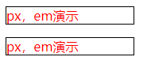
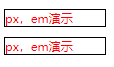
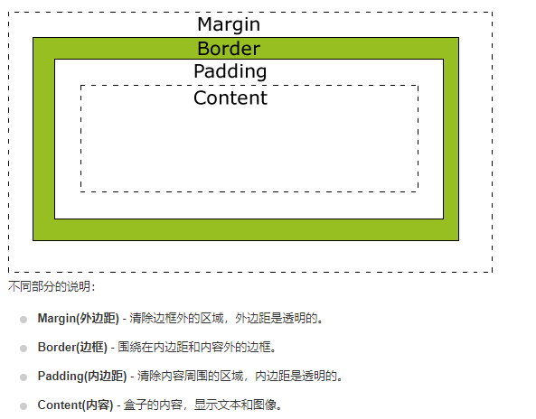

# MDN_CSS_01

## CSS简介

CSS：层叠样式表

语法构成：

```css
h1 {
    color:red;
    font-size:5em;
}
/*
selector {
property: value;
}
*/
```

## CSS选择器基础

1. 类选择器
2. id选择器
3. 多类选择器 （空格隔开）
4. 通配符选择器
5. 交集选择器 
6. 并集选择器 (逗号)
7. 后代选择器 （包含选择器 使用空格隔开）
8. 子元素选择器 （父元素 > 子元素）

```css
/*选择器实例*/
h1 {
	color: red;
}

/*使用逗号分隔符可使用多个选择器*/
p, li {
	color: green;
}
/*改变元素的默认行为*/
li {
	/*list-style-type: none;*/
	list-style-type:square;
}
/*类选择器使用点来选择*/
.special {
	color: orange;
	font-weight: blod;
}
/*选中special类的li元素*/
li.special {
	color: red;
	font-weight: bold;
}

/*根据元素在文档中的位置来确定*/
em {
	color: rebeccapurple;
}
/*只有li嵌套的em元素变色*/
li em {
	color: red;
}
/*相邻兄弟组合器：只装饰h1后面的p标签，且两者具有相同的父标签*/
h1 + p {
	font-size: 200%;
}

/*
	注意： 在CSS定义中，a:hover 必须被置于 a:link 和 a:visited 之后，才是有效的。
	注意： 在 CSS 定义中，a:active 必须被置于 a:hover 之后，才是有效的。
	注意：伪类的名称不区分大小写。

 */

/*未访问*/
a:link {
	color:pink;
}
/*已访问过*/
a:visited {
	color: purple;
}

/*鼠标悬停*/
a:hover {
	text-decoration: none;
}
/*点击时*/
a:active {
	color: red;
}


```

## CSS结构

- 外部样式表

  - 通过创建并且引入CSS外部文件

- 内部样式表

  - 在`<head></head>`中引入`<style></style>`

  ```css
  <!DOCTYPE html>
  <html lang="en">
  <head>
  	<meta charset="UTF-8">
  	<title>CSS结构练习</title>
  	<style>
  		h1 {
  			color: blue;
  			background-color: yellow;
  			border: 1px solid black;
  		}
  		p {
  			color: red;
  		}
  	</style>
  </head>
  <body>
  	<h1>Hello World!</h1>
      <p>This is my first CSS example</p>
  </body>
  </html>
  ```

- 内联样式表

  ```css
  <!DOCTYPE html>
  <html lang="en">
  <head>
  	<meta charset="UTF-8">
  	<title>内联样式表</title>
  </head>
  <body>
  	<h1 style="color:blue; background-color: yellow border:1px solid black">Hello World!!!</h1>
  	<p style="color: red">This is my first CSS example</p>
  </body>
  </html>
  ```

内联样式表难以维护；使得代码难以阅读

## 常见属性和值

1. `font-size`:字体大小，从1~7  默认为3

2. `width`:`content`的宽度

   - `px`绝对长度单位

   - `em`

     - 浏览器默认`16px` 所以`1em = 16px`

     - 简化计算：`1em = 10px`

       ```css
       body {
           font-size:62.5%; /*16px x 62.5% = 10px*/
       }
       ```

     - 缺点:

       - `em`不是固定的
       - `em`会继承父级元素的字体的大小`参考物是父级元素的font-size`
       - 如果：一个设置了`font-size:1.2em`；另一个设置了`font-size:1.2em`；在设置一个`font-size:1.2em`。其结果为`1.2x1.2x1.2 = 1.728em`

   ```css
   <!DOCTYPE html>
   <html lang="en">
   <head>
   	<meta charset="UTF-8">
   	<title>CSS作用规则</title>
   	<style>
   		.special {
   			color: blue;
   		}
   		p {
   			color: red;
   		}
   		.pxclass {
   			width: 160px;
   			border: 1px solid black;
   		}
   		.emclass {
   			width: 10em;
   			border: 1px solid black;
   		}
   	</style>
   </head>
   <body>
   
   	<h1>CSS作用规则</h1>
   	<!-- 显示红色，后面的样式覆盖前面的样式 -->
   	<p class="blue">What Color is I</p>
   
   	<p class="pxclass">px，em演示</p>
   	<p class="emclass">px，em演示</p>
   </body>
   
   </html>
   ```

   

   ```css
   <!DOCTYPE html>
   <html lang="en">
   <head>
   	<meta charset="UTF-8">
   	<title>CSS作用规则</title>
   	<style>
   		body {
   			font-size: 62.5%;
   		}
   		.special {
   			color: blue;
   		}
   		p {
   			color: red;
   		}
   		.pxclass {
   			width: 100px;
   			border: 1px solid black;
   		}
   		.emclass {
   			width: 10em;
   			border: 1px solid black;
   		}
   	</style>
   </head>
   <body>
   
   	<h1>CSS作用规则</h1>
   	<!-- 显示红色，后面的样式覆盖前面的样式 -->
   	<p class="blue">What Color is I</p>
   
   	<p class="pxclass">px，em演示</p>
   	<p class="emclass">px，em演示</p>
   </body>
   
   </html>
   ```

   

   

   

3. `background-color`:背景颜色

4. `color`:字体颜色

5. `border`: `border-width border-style border-color`

### 函数

大多数属性的值都是相对简单的关键字或者值；但是也有一些可能的值以函数的形式出现

```html

```


