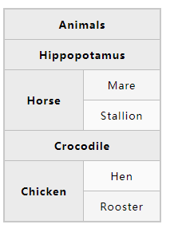

# MDN_HTML_04

## HTML表格基础

不推荐使用表格进行布局：

- 表格会产生很多标签
- 表格不能自动响应

```html
<table border="1px">
		<tr>
			<th colspan="2">Animals</th>
		</tr>
		<tr>
			<th colspan="2">Hippopotamus</th>
		</tr>
		<tr>
			<th rowspan="2">Horse</th>
			<td>Mare</td>
		</tr>
		<tr>
			<td>Stallion</td>
		</tr>
		<tr>
			<th colspan="2">Crocodile</th>
		</tr>
		<tr>
			<th rowspan="2">Chicken</th>
			<td>Cock</td>
		</tr>
		<tr>
			<td>Rooster</td>
		</tr>
	</table>
```



### 表格的每一列提供共同样式

`<col> <colgroup>`

```html
<!--一列一列的提供样式-->
<colgroup>
<col style="background-color:yellow">
<col>
<col>
</colgroup>
```

### 为你的表格增加一个标题

```html
<table>
    <caption>标题描述</caption>
</table>
```

### 添加结构信息

`thead`表头

`tfoot`页脚

`tbody`正文

### 更好的理解标题单元格

`scope`

```html
<thread>
    <tr>
        <th scope="col">Purchase</th>
    </tr>
</thread>
```

## HTML表单

`HTML`表单是用户和WEB站点交互的主要内容之一。他们允许用户将数据发布到web站点。

### 表单基础

`<form></form>`正式定义了一个表单

```html
<form action="./my-page" method="post"></form>

<!--
	action:数据去处
	method:定义发送数据的HTTP方式（post/get）
-->
```

```html
<!DOCTYPE html>
<html lang="en">
<head>
	<meta charset="UTF-8">
	<title>表单测试</title>
</head>
<body>
	<form action="#" method="post">
		<div>
			<label for="name">Name:</label>
			<input type="text" id="name">
		</div>
		<div>
			<label for="mail">mail:</label>
			<input type="email" id="mail" value="默认值">
		</div>
		<div>
			<label for="msg">msg:</label>
			<textarea name="" id="sg" cols="30" rows="10">默认值</textarea>
		</div>
		<div>
			<button type="submit">Send your message</button>
		</div>
	</form>
</body>
</html>
```

- `<div>`可以实现方便的构造自己的代码
- `<label>`标签的`for`属性：
  - 将标签链接到表单小部件的一种正规方式，这个属性引用对应的小部件的`id`
  - 允许用户单击标签从而激活相应的小部件
  - `label`标签的 `for`属性和`<input>`标签的`id`属性相关联
- `<input>`元素中，最重要的是`type`属性，规定了`<input>`的输入方式
  - 可以改变输入方式
  - 可以从根本上改变
- `<intput>`标签是一个空标签，无需关闭；`<textarea>`不是一个空元素，需要一个结束标签。
- `<input>`定义默认值，使用`<value>`属性；`textarea`的默认值定义在开始标签和结束标签之间就可以
- `<button>`支持三种属性:
  - `submit`:发送表单数据到网页
  - `reset`：网页数据全部设置为默认值
  - `button`：使用`JavaScript`构建网页时非常有用

可以通过标签来激活相应的小部件

`fieldset` `legend`

- `fieldset`元素是一种方便的用于创建具有相同目的小部件组的方式，出于样式和语义化的目的
- `legend`的文本内容正是描述了`<fieldset>`里面所含有部件的用途

`<section>`: 信息分段处理


