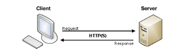

# MDN_HTML_05

## 原生表单挂件

通用属性：

- `autofocus`：允许指定当前页面加载是元素应该自动具有输入焦点
- `disabled`：能否与元件交互
- `form`：小部件与之相关的表单元素
- `name`：元素的名称
- `value`元素初始值

## 发送表单数据

客户端/服务器体系结构



客户端使用`form`来定义如何发送数据

```html
<form action-"#" method="get/post">

</form>
```

`GET方法`：

```html
<form action="http://foo.com" method="get">
  <div>
    <label for="say">What greeting do you want to say?</label>
    <input name="say" id="say" value="Hi">
  </div>
  <div>
    <label for="to">Who do you want to say it to?</label>
    <input name="to" id="to" value="Mom">
  </div>
  <div>
    <button>Send my greetings</button>
  </div>
</form>
```

当提交表单时：会出现`www.foo.com/?say=Hi&to=Mom `

HTTP请求如下：

```html
GET /?say=Hi&to=Mom HTTP/2.0
Host: foo.com
```

`POST`方法：

```html
<form action="http://foo.com" method="post">
  <div>
    <label for="say">What greeting do you want to say?</label>
    <input name="say" id="say" value="Hi">
  </div>
  <div>
    <label for="to">Who do you want to say it to?</label>
    <input name="to" id="to" value="Mom">
  </div>
  <div>
    <button>Send my greetings</button>
  </div>
</form>
```

HTTP请求如下：

```html
POST / HTTP/2.0
Host: foo.com
Content-Type: application/x-www-form-urlencoded
Content-Length: 13

say=Hi&to=Mom
```

### 查看HTTP请求

1. 按下 F12
2. 选择 "Network"
3. 选择 "All"
4. 在 "Name" 标签页选择 "foo.com"
5. 选择 "Headers"

使用GET请求的用户将在他们的URL栏中看到数据

使用POST请求的用户将不会看到数据

- 当发送敏感信息时，永远不要使用GET方法
- 当发送大量数据的时候，POST方法是首选，因为浏览器限制了URL大小

