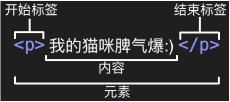
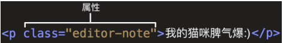
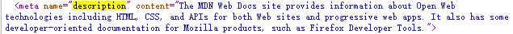
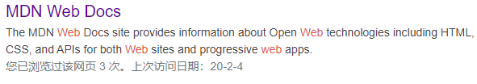
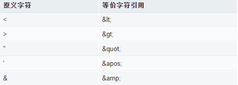

# MDN_HTML笔记

- [MDN_HTML笔记](#MDN_HTML笔记)
  * [WEB入门](#WEB入门)
    + [编辑器推荐](#编辑器推荐)
    + [如何设计网页](#如何设计网页)
    + [处理文件](#处理文件)
  * [HTML基础](#HTML基础)
    + [元素讲解](#元素讲解)
    + [块级元素和内联元素](#块级元素和内联元素)
      - [块级元素[block]](#块级元素[block])
      - [内联元素[inline]](#内联元素[inline])
    + [空元素（void/empty Element）](#空元素（void/empty Element）)
  * [HTML页面讲解](#HTML页面讲解)
    + [元数据 meta 元素](#元数据 meta 元素)
  * [标记文本](#标记文本)
      - [标题（Heading）](#标题（Heading）)
      - [段落（Paragraph）](#段落（Paragraph）)
      - [列表(List)](#列表(List))
        * [无序列表（Unordered List）](#无序列表（Unordered List）)
        * [有序列表 (Ordered List)](#有序列表 (Ordered List))
    + [链接（Link）](#链接（Link）)
    + [布尔属性](#布尔属性)
    + [省略包围属性值的引号](#省略包围属性值的引号)
  * [单引号or双引号](#单引号or双引号)
  * [HTML中空白](#HTML中空白)
  * [实体引用：在HTML中包含特殊字符](#实体引用：在HTML中包含特殊字符)
  * [HTML注释](#HTML注释)
  * [在HTML中应用CSS和JavaScript](#在HTML中应用CSS和JavaScript)
  * [为文档设定主语言](#为文档设定主语言)


## WEB入门

### 编辑器推荐

推荐使用`VSCode`,提供了实时预览和代码提示

### 如何设计网页

1. 做出技术
2. 设计草稿
3. 选择内容

### 处理文件

关于大小写和空格的提示：

- 所有的文件夹名称和文件名称都是用小写字母且没有空格
  - 对于WEB服务器来说，是对大小写敏感的
    - 如：`test-site/MyImage.jpg `和`test-site/myImage.jpg`为两个不同的路径
  - 文件名称有空格的话，一些系统会将这个文件试做2个文件名称；还有的系统会将空格进行替代
- 最好的文件名称命名方式为：使用横线来分离单词：`my-file.html`而不是`my_file.html`

文件夹结构：

```html
site文件夹  ：主页
image文件夹 ：网页图像数据
styles文件夹 ：网页样式表
scripts文件夹 ：网页交互功能的JavaScript文件
```

文件路径的通用规则：

- 同级目录：直接使用文件名
- 引用子目录文件，`xxx/xxx.jpg`
- 引用父级目录文件：`../xxx.jpg`

## HTML基础

HTML (Hypertext Markup Language)超文本标记语言

- `Hypertext`:连接单个网站或者多个网站
- `Markup`:使用标记来标注是文本 图像或者其他什么东西 ,便于在WEB中进行显示
- HTML通过使用标签`tag`将文本从文档中引出来，标签通过`<tag>`这种形式组成
- **HTML不区分大小写**

HTML 构成网页内容的含义和结构

CSS用来描述一个网页的表现与展示效果

JavaScript用来描述一个网页的功能或者行为

人：骨架（HTML） + 肉（CSS）+ 动作（JavaScript）

### 元素讲解



开始标签 内容 结束标签称之为一个元素

元素属性讲解：



**元素属性值和多个元素属性写法的区别**


### 块级元素和内联元素

#### 块级元素[block]

块级元素在页面中以块的形式展现：

- 相对于前面的内容，他会出现在新的一行；
- 其后的内容也会出现在新的一行

#### 内联元素[inline]

通常出现在块状元素中，并且环绕内容的一小部分。

内联元素不会导致文本换行


### 空元素（void/empty Element）

不包含任何内容的元素称之为空元素，比如``标签

```html

```

``标签没有结束标签，元素中也没有内容。

## HTML页面讲解

```html
<!--文档类型-->
<!DOCTYPE HTML>
<!--根元素-->
<html>
    <!--非用户展示，包含各种设置-->
    <head>
        <!--当前文档的字符编码-->
        <meta charset="utf-8">
        <!--页面标题，同时作为收藏网页的描述文字--> 
        <title>测试页面</title>
    </head>
    <!--用户访问时看到的内容-->
    <!--img的alt属性为图像的描述内容部分-->
    <body>
        
    </body>
</html>
```

### 元数据 meta 元素

```html
<meta charset="utf-8">
```

许多`<meta>`元素还包含了`name`和`content`这两个特性：

- `name`指定了`meta`的名称，说明了该元素包含了什么类型的信息
- `content`指定了实际的元数据内容

```html
<meta name="author" content="wyk"
```

**`meta`的`description` 类型信息，也被使用在搜索引擎显示的结果页面中**。





## 标记文本

#### 标题（Heading）

类似于书本的`Chapter`

一共有6级标题`<h1>-<h6>`

不要使用标题元素来加大加粗字体，因为标题对于无障碍阅读和搜索引擎优化等问题非常有意义。

#### 段落（Paragraph）

`<p>内容</p>`

#### 列表(List)

##### 无序列表（Unordered List）

`<ul><li></li><ul>`

##### 有序列表 (Ordered List)

`<ol><li></li><ol>`

```html
<p>Mozilla 是一个全球社区，这里聚集着来自五湖四海的：</p>
        <ul>
        	<li>技术人员</li>
        	<li>思考者</li>
        	<li>建造者</li>
        </ul>
        <p>我们致力于.....</p>
```

### 链接（Link）

`<a></a>` `anchor`的缩写

```html
<!--
	href:超链接
	title:鼠标悬停时的显示
	target:超链接打开方式
-->
<a href="xxx.com" title="index.html" target="_blank"></a>
```

### 布尔属性

有时候我们会看到没有值的属性，这是合法的。这种属性称之为布尔属性。表明属性值和属性名一致。

如：下面两种写法都是正确的

`<input type="text" disabled="disabled">`

`<input type="text" disabled>`

### 省略包围属性值的引号

当浏览web网站时，会看到奇奇怪怪的标记

```html
<!--currect-->
<a href="https://www.baidu.com" title="The ssss">
<!--前半部分是对的，后半部分的ssss会被视作布尔属性-->
<a href=https://www.baidu.com>  title=The ssss>
```

## 单引号or双引号

在HTML中单引号和双引号都是可以的

在HTML中以使用一种引号的前提下，可以在这种引号的前提下嵌套另一种引号

## HTML中空白

HTML在解释的时候会将连续出现的空白字符减少为一个单独的空字符

我们在书写的时候使用大量空格是因为代码的格式化和可读性

```html
<p>
    狗 狗 很 萌 很 可 爱 ！
</p>
<p>
    狗             狗             很        萌     很 可 爱 ！
</p>
```

上述代码效果一致

## 实体引用：在HTML中包含特殊字符



## HTML注释

```html
<!--HTML注释-->
```

## 在HTML中应用CSS和JavaScript

使用`<link>` 和 `script`这两个元素

- `<link>`元素经常用在文档的头部

  ```html
  <link rel="stylesheet" href="my-css-file.css">
  ```

- `script`部分没必要放在文档的头部；实际上，把它放在文档的尾部(在`</body>`标签之前)是一个更好的选择

  - 这样可以确保在加载脚本之前浏览器已经解析出了HTML内容
  - 如果脚本加载某个不存在的元素，浏览器会把报错

```html
<script src="my-js-file.js"></script>
```

注意：

- `<script>`元素看起来像是一个空元素；但实际上不是，因此需要一个结束标志
- 还可以将脚本内容放在`<script>xxx</script>`中，而不是指向外部脚本文件

## 为文档设定主语言

应该为WEB网页设定语言，通过添加`lang=“en-US”`

```html
<html lang="en-US">
    
</html>
```

