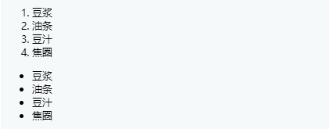
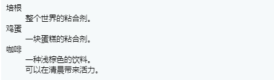
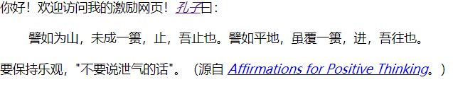
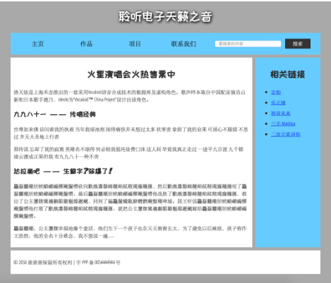

# MDN_HTML_02

## HTML文字处理基础

### 基础：段落和标签

段落标签：`<p>内容</p>`

标题标签`<h1>内容</h1>`

层次编辑：

```html
<h1>三国演义</h1>

<p>罗贯中</p>

<h2>第一回 宴桃园豪杰三结义 斩黄巾英雄首立功</h2>

<p>话说天下大势，分久必合，合久必分。周末七国分争，并入于秦。及秦灭之后，楚、汉分争，又并入于汉……</p>

<h2>第二回 张翼德怒鞭督邮 何国舅谋诛宦竖</h2>

<p>且说董卓字仲颖，陇西临洮人也，官拜河东太守，自来骄傲。当日怠慢了玄德，张飞性发，便欲杀之……</p>

<h3>却说张飞</h3>

<p>却说张飞饮了数杯闷酒，乘马从馆驿前过，见五六十个老人，皆在门前痛哭。飞问其故，众老人答曰：“督邮逼勒县吏，欲害刘公；我等皆来苦告，不得放入，反遭把门人赶打！”……</p>
```

代码注意事项：

- 每一个页面的`<h1>`只使用一次，因为这是顶级标签
- 确保正确顺序使用主题标签`<h1><h2><h3><h4><h5><h6>`
- 每一WEB页面的主题标签不超过3个

```html
<h1>
    静夜思
</h1>
<p>
    床前明月光，疑是地上霜。
</p>
<p>
    举头望明月，低头思故乡。
</p>
```

**注意：**

上述为语义便签，便于我们进行理解文字的处理过程；

当然可以使用CSS得到相同的效果，但是没有语义，不好理解！！！

### 列表Lists

```html
<!--有序列表和无序列表-->
<ol>
    <li>豆浆</li>
    <li>油条</li>
    <li>豆汁</li>
    <li>焦圈</li>
</ol>

<ul>
    <li>豆浆</li>
    <li>油条</li>
    <li>豆汁</li>
    <li>焦圈</li>
</ul>
```



### 重点强调

斜体：`<em>内容</em>`

粗体：`<strong>内容</strong>`

斜体字:`<i>内容</i>`

粗体字：`<b>内容</b>`

下划线：`<u>内容</u>`

## 建立超链接

```html
<p>
    I am create a link to
    <a href="https://www.mozilla.org/en-US/" title="鼠标悬停">The Mozilla homepage</a>
</p>
```

### 统一资源定位符-URL和路径-path

`URL(Uniform Resources Locator )`

**指向文档片段**

```html
<h2 id="milliza_address">
    Mailing c
</h2>

<p>
    xxx Use our<a href="xxx.html#milliza_address">milliza_address</a>
</p>
```

### 链接最佳实践

链接最好留下清晰的指示

```html
<p><a href="http://www.example.com/large-report.pdf">
  下载销售报告（PDF, 10MB）
</a></p>

<p><a href="http://www.example.com/video-stream/">
  观看视频（将在新标签页中播放, HD画质）
</a></p>

<p><a href="http://www.example.com/car-game">
  进入汽车游戏（需要Flash插件）
</a></p>
```

在下载链接时使用`download`属性：

- 当您链接到要下载的资源而不是在浏览器中打开时，您可以使用 download 属性来提供一个默认的保存文件名 

```html
<a href="https://download.mozilla.org/?product=firefox-latest-ssl&os=win64&lang=en-US"
   download="firefox-latest-64bit-installer.exe">
  Download Latest Firefox for Windows (64-bit) (English, US)
</a>
```

## 高阶文字排版（待续）

### 描述列表 description-list

```html
<!--description-->
<dl>
    <!--description term-->
    <dt>
        <!--description description-->
    	<dd>
        
        </dd>
    </dt>
</dl>
```

```html
<dl>
  <dt>培根</dt>
    <dd>整个世界的粘合剂。</dd>
  <dt>鸡蛋</dt>
    <dd>一块蛋糕的粘合剂。</dd>
  <dt>咖啡</dt>
    <dd>一种浅棕色的饮料。</dd>
    <dd>可以在清晨带来活力。</dd>
</dl>
```



### 引用

**块引用：**会在前面进行缩进

`<blockquote cite="引用网址">内容</blockquote>`

**行内引用：**会产生双引号

`<q>内容</q>`

```html
<p>你好！欢迎访问我的激励网页！<a href="http://www.brainyquote.com/quotes/authors/c/confucius.html"><cite>孔子</cite></a>曰：</p>
<blockquote cite="https://zh.wikipedia.org/zh-hans/孔子">
  <p>譬如为山，未成一篑，止，吾止也。譬如平地，虽覆一篑，进，吾往也。</p>
</blockquote>
<p>要保持乐观，<q cite="http://www.affirmationsforpositivethinking.com/">不要说泄气的话</q>。（源自 <a href="http://www.affirmationsforpositivethinking.com/"><cite>Affirmations for Positive Thinking</cite></a>。）</p>
```



### 上标和下标

`<sup>`

`<sub>`

### 标记时间和日期

HTML还支持将时间和日期标记为可供及其识别的格式`<time>`

```html
<time datetime="2016-02-11">2016年02月11日</time>
```

不同的时间格式不容易被电脑识别

加入自己想要自动抓取页面上所有事件的日期，并且将他们插入到日历中

`<time>`元素允许你附上清晰的、可被机器识别的时间\日期来实现这种需求


## 文档与网站架构

### 文档的基本组成部分

- 页眉
- 导航栏
- 主内容
- 侧边栏
- 页脚

典型的网站布局：



HTML代码中可根据功能来为区域添加标记

`<header>`

`<nav>`

`<main>`

`<aside>`

`<footer>`

#### 无语义元素

`<div>`块元素

`<span>`内联元素

`<br>`换行

`<hr>`生成水平分割线

## HTML调试

可以验证HTML代码正确性：

[Markup Validation Service](https://validator.w3.org/) 